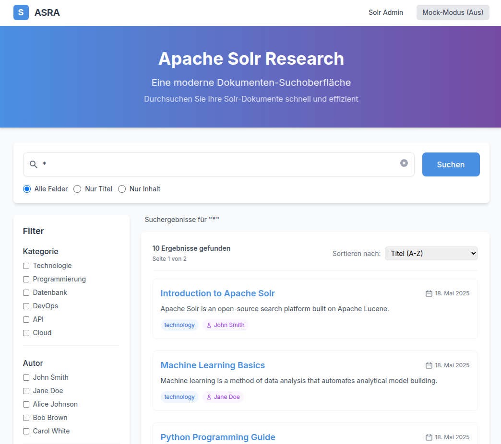

# ASRA - Apache Solr Research Application

ASRA ist eine moderne Webapplikation für die Dokumentensuche, die Apache Solr als Suchbackend verwendet. Die Anwendung bietet eine benutzerfreundliche Oberfläche, um mit einem Solr-Index zu interagieren und Dokumente effizient zu durchsuchen.

## Funktionen

### ✅ Implementierte Features
- **Echtzeit-Suche**: Schnelle Dokumentensuche mit sofortigen Ergebnissen
- **Benutzerfreundliche Oberfläche**: Modernes, responsives UI mit React und Tailwind CSS
- **Fehlerbehandlung**: Robuste Fehlerbehandlung und Ladezustände für eine bessere Benutzererfahrung
- **Solr-Integration**: Nahtlose Integration mit Apache Solr über REST-API
- **Docker-Integration**: Vollständige Containerisierung mit Docker Compose für Frontend und Solr-Backend
- **CORS-freie Architektur**: Vermeidung von Cross-Origin-Problemen durch integrierte Reverse-Proxy-Konfiguration
- **Entwickler-Modus**: Mock-Modus für Entwicklung und Tests, der ohne Solr-Backend funktioniert
- **Fortgeschrittene Suchoptionen**: Suche in bestimmten Feldern (Titel, Inhalt, Alle)
- **Paginierung**: Unterstützung für große Ergebnismengen mit einer intuitiven Paginierung
- **Responsive Design**: Optimiert für Desktop, Tablet und Mobilgeräte
- **Code-Splitting**: Lazy Loading für optimierte Performance und kleinere Bundle-Größen
- **Professional UI**: Moderne Navbar, Sidebar und Footer für eine professionelle Benutzererfahrung
- **Dynamische Facetten-Filter**: Kontextuelle Filter für Kategorien und Autoren basierend auf Suchergebnissen
- **Content-Highlighting**: Hervorhebung von Suchbegriffen in den Ergebnissen
- **Filter-State-Management**: Intelligente Filterung, die sich automatisch an Suchergebnisse anpasst

### 🚧 In Entwicklung (Phase 1 - Juni 2025)
- **Auto-Suggest**: Suchvorschläge basierend auf vorhandenen Dokumenten
- **Erweiterte Sortierung**: Sortierung nach Relevanz, Datum und Titel
- **Datum-Range-Filter**: Zeitbasierte Filterung von Dokumenten

### 🎯 Geplante Features (Phase 2+)
- **Dokumentvorschau**: Modal-Ansicht für Dokumenteninhalte
- **Webcrawler-Integration**: Automatischer Import von Daten aus gesetze-im-internet.de
- **Erweiterte Authentifizierung**: Benutzerkonten und gespeicherte Suchen
- **Export-Funktionen**: PDF- und CSV-Export von Suchergebnissen

## Screenshots

### Hauptansicht

*Die modernisierte Benutzeroberfläche von ASRA mit Navbar, Suchleiste und Ergebnisanzeige*

### Suchfunktionalität

*Suchergebnisse mit Highlighting und Metadatenanzeige*

### Responsive Design

*ASRA auf einem mobilen Gerät*

## Installation

### Voraussetzungen

- Node.js (v14 oder höher)
- npm oder yarn
- Docker und Docker Compose
- Internetverbindung für den Zugriff auf Fonts und Abhängigkeiten

### Schritte zur Installation

1. Klone das Repository:
   
   ```bash
   git clone https://github.com/username/asra.git
   cd asra
   ```

2. Installiere die Abhängigkeiten:
   
   ```bash
   npm install
   ```

3. Starte die Anwendung mit Docker Compose:
   
   ```bash
   ./start_app.sh
   ```

4. Öffne im Browser:
   - Frontend: http://localhost:8080
   - Solr Admin UI: http://localhost:8983/solr/

### Entwicklungsmodus starten

Um die App im Entwicklungsmodus zu starten (mit Hot-Reloading):

```bash
# Starte Solr im Hintergrund
./start_app.sh

# Starte den Vite-Entwicklungsserver in einem anderen Terminal
npm run dev
```

Dann öffne im Browser: http://localhost:5173

## Konfiguration

### Solr-Konfiguration

Die Solr-Konfiguration befindet sich im Verzeichnis `docker/solr/configsets/documents/conf/`:

- `schema.xml`: Definiert die Feldstruktur und Indexierungsoptionen
- `solrconfig.xml`: Enthält die Solr-Kernkonfiguration
- `stopwords.txt`: Enthält Stoppwörter für die Textanalyse

### Frontend-Konfiguration

- Der Solr-Endpunkt wird automatisch konfiguriert:
  - Im Produktionsmodus (Docker): Verwendet einen relativen Pfad `/solr/` um CORS-Probleme zu vermeiden
  - Im Entwicklungsmodus: Verwendet die in `.env` definierte URL oder Standard-URL `http://localhost:8983/solr/`
- Die Umgebungserkennung erfolgt über `import.meta.env.MODE`, was für Vite-Anwendungen der korrekte Weg ist
- Der Solr-Core (`documents`) ist im API-Pfad enthalten, um korrekte Anfragen zu gewährleisten
- Anpassungen des Erscheinungsbilds können in `tailwind.config.js` vorgenommen werden

### Umgebungsvariablen

Die Anwendung verwendet die folgenden Umgebungsvariablen, die in einer `.env`-Datei konfiguriert werden können:

- `VITE_SOLR_URL`: URL zum Solr-Server (nur für Entwicklung, Standard: `http://localhost:8983/solr/`)

## Deployment

### Mit Docker Compose (empfohlen)

Die empfohlene Methode ist die Verwendung von Docker Compose, das sowohl das Frontend als auch Solr startet:

```bash
# Für Entwicklung und Test
./start_app.sh

# Für Produktionsumgebungen
./deploy.sh
```

### Manuelle Installation

Für eine manuelle Installation ohne Docker:

1. Starte einen Solr-Server (Version 9.x) und importiere die Konfiguration
2. Passe die Solr-URL in `.env` an
3. Baue die Frontend-Anwendung: `npm run build`
4. Hoste die gebaute Anwendung (im `dist`-Verzeichnis) mit einem Webserver wie Nginx

## Entwicklung

### Verfügbare Skripte

- `npm run dev`: Startet den Entwicklungsserver mit Hot-Reload
- `npm run build`: Erstellt eine optimierte Produktions-Build
- `npm run preview`: Startet einen lokalen Server für die Vorschau des Builds

### Mock-Modus

Die Anwendung bietet einen Mock-Modus, der ohne Solr-Backend funktioniert:

1. Starte die Anwendung im Entwicklungsmodus: `npm run dev`
2. Klicke in der Navigationsleiste auf "Mock-Modus (Aus)", um ihn zu aktivieren
3. Mock-Daten werden für alle Suchanfragen verwendet, ideal für UI-Entwicklung

### Architektur

Die Anwendung folgt einer modularen Architektur:

- React-Komponenten in `/src/components`
  - **Dynamic Components**: `DynamicApp.jsx`, `DynamicSearchBar.jsx`, `DynamicSidebar.jsx`, `DynamicResultsDisplay.jsx` - Hauptkomponenten mit voller Solr-Integration
  - **Static Components**: `Navbar.jsx`, `Footer.jsx`, `Pagination.jsx` - Wiederverwendbare UI-Komponenten
- Dienste für API-Interaktionen in `/src/services`
  - `solrService.js` - Hauptschnittstelle zu Apache Solr mit Mock-Fallback
  - `schemaService.js` - Dynamische Facetten und Schema-Management
- Docker-Konfiguration in `/docker`
  - Nginx als Reverse-Proxy und statischer Dateiserver in `/docker/nginx`
  - Solr-Konfiguration in `/docker/solr`

#### Neue Architektur-Features (Juni 2025)
- **Kontextuelle Facetten**: Filter werden dynamisch basierend auf aktuellen Suchergebnissen generiert
- **Unified Search Response**: Eine einzige API-Antwort enthält sowohl Suchergebnisse als auch passende Filter
- **Content Highlighting**: Automatische Hervorhebung von Suchbegriffen in Volltext-Ergebnissen

### Docker-Container

Die Anwendung besteht aus zwei Docker-Containern:

1. **solr_server**: Apache Solr-Server mit vorkonfiguriertem Schema
2. **asra_frontend**: Nginx-Server mit der gebauten React-Anwendung und Reverse-Proxy-Konfiguration

## Versionierung

Dieses Projekt verwendet semantische Versionierung (SemVer). Alle Änderungen werden in der [CHANGELOG.md](CHANGELOG.md) dokumentiert.

## Für neue Entwickler

### Schnellstart

1. Klone das Repository und installiere die Abhängigkeiten:
   ```bash
   git clone https://github.com/username/asra.git
   cd asra
   npm install
   ```

2. Starte die Anwendung im Entwicklungsmodus:
   ```bash
   npm run dev
   ```

3. Aktiviere den Mock-Modus in der Navbar, wenn du ohne Solr-Backend entwickeln möchtest.

### Wichtige Dateien und Komponenten

- `src/DynamicApp.jsx`: Hauptkomponente der Anwendung mit vollständiger Solr-Integration
- `src/components/`: UI-Komponenten
  - **Dynamic Components** (mit Solr-Integration):
    - `DynamicSearchBar.jsx`: Suchleiste mit erweiterten Filteroptionen
    - `DynamicResultsDisplay.jsx`: Anzeige der Suchergebnisse mit Content-Highlighting
    - `DynamicSidebar.jsx`: Dynamische Seitenleiste mit kontextuellen Facetten-Filtern
  - **Static Components**:
    - `Navbar.jsx`: Navigationsleiste mit Mock-Umschalter
    - `Footer.jsx`: Fußzeile mit Links und Projektinfo
    - `Pagination.jsx`: Seitennavigation für Ergebnisse
- `src/services/`: API-Services
  - `solrService.js`: Hauptschnittstelle zu Solr mit Mock-Funktionalität
  - `schemaService.js`: Dynamische Facetten und Schema-Management
- `vite.config.js`: Konfiguration des Entwicklungsservers und Proxy
- `tailwind.config.js`: Anpassungen des Designs und der Farben

### Entwicklungshinweise

1. **Komponenten**: Halte Komponenten klein und fokussiert. Verwende funktionale Komponenten mit Hooks.
2. **Styling**: Nutze Tailwind-Klassen direkt in JSX für das Styling.
3. **API-Aufrufe**: Alle Solr-Interaktionen sollten über `solrService.js` erfolgen.
4. **Fehlerbehandlung**: Implementiere try/catch-Blöcke für alle asynchronen Operationen.
5. **Dokumentation**: Füge JSDoc-Kommentare zu allen Funktionen und Komponenten hinzu.

### Aktuelle Arbeitsschwerpunkte (Juni 2025)

**Sprint 1 (KW 23-24): Facetten-Filter-Implementation**
- Dynamische Solr-Facetten-Integration für Kategorien, Autoren und Datum
- Filter-State-Management zwischen Suchanfragen
- Erweiterte Sidebar-Funktionalität mit echten Daten

**Sprint 2 (KW 25-26): Auto-Suggest und Sortierung** 
- Autocomplete-Funktionalität basierend auf Solr-Begriffen
- Erweiterte Sortieroptionen in der Ergebnisanzeige
- Suchhistorie mit LocalStorage

**Langfristige Roadmap**:
- Webcrawler-Implementation für automatischen Datenimport aus gesetze-im-internet.de
- Dokumentvorschau und -interaktion
- Erweiterte Authentifizierung und Benutzerverwaltung

Siehe [TASK.md](TASK.md) für eine vollständige Liste der anstehenden Aufgaben und detaillierte Sprint-Planung.

## Lizenz

Dieses Projekt ist unter der MIT-Lizenz lizenziert.
