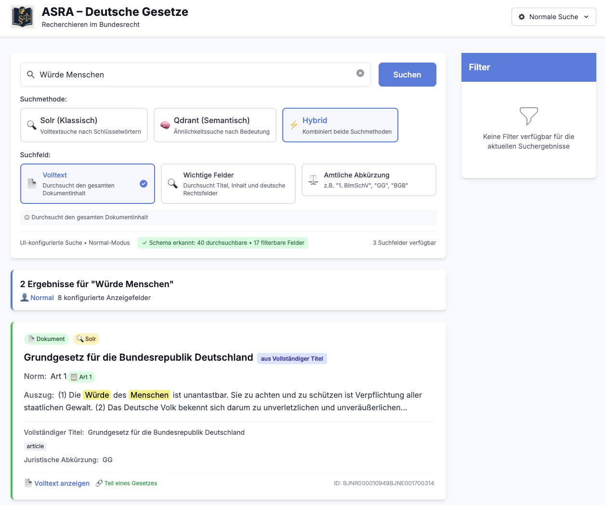
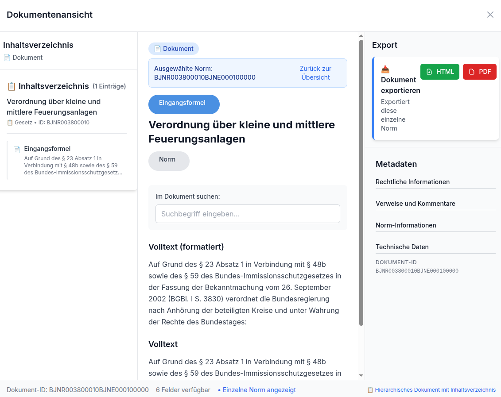

# ASRA – Deutsche Gesetze

ASRA – Deutsche Gesetze ist eine spezialisierte Webapplikation für die Recherche im Bundesrecht, die Apache Solr als Suchbackend verwendet. Die Anwendung bietet eine benutzerfreundliche Oberfläche, um deutsche Rechtsdokumente effizient zu durchsuchen und zu analysieren.

## Funktionen

### ✅ Implementierte Features
- **Norm-Level-Indexierung**: Granulare Indexierung einzelner Rechtsnormen statt ganzer Dokumente
- **XHTML-Formatierung**: Erhaltung der ursprünglichen XML-Formatierung in HTML-Darstellung
- **Konfigurierbare UI-Modi**: Normal-Modus (5 benutzerfreundliche Felder) ↔ Experten-Modus (alle Solr-Felder)
- **Deutsche Rechtsabkürzungen**: Vollständige Unterstützung für Suchen wie "1. BImSchV", "GG", "BGB"
- **Präzise Artikel-Suche**: Finde spezifische Artikel (z.B. "Art 70 GG") statt ganzer Gesetzbücher
- **Norm-Badge-System**: Visuelle Kennzeichnung von Artikeln, Paragraphen und Rechtsnormen
- **Export-Funktionen**: PDF- und HTML-Export von Dokumenteninhalten mit professioneller Formatierung
- **Volltext-Dokumentenansicht**: Erweiterte Ansicht mit korrekter Absatzformatierung und Inhaltsverzeichnis
- **Intelligente Dateinamen**: Automatische Generierung aussagekräftiger Export-Dateinamen
- **Echtzeit-Suche**: Schnelle Dokumentensuche mit sofortigen Ergebnissen
- **Benutzerfreundliche Oberfläche**: Modernes, responsives UI mit React und Tailwind CSS
- **Fehlerbehandlung**: Robuste Fehlerbehandlung und Ladezustände für eine bessere Benutzererfahrung
- **Solr-Integration**: Nahtlose Integration mit Apache Solr über REST-API
- **Docker-Integration**: Vollständige Containerisierung mit Docker Compose für Frontend und Solr-Backend
- **CORS-freie Architektur**: Vermeidung von Cross-Origin-Problemen durch integrierte Reverse-Proxy-Konfiguration
- **Entwickler-Modus**: Mock-Modus für Entwicklung und Tests, der ohne Solr-Backend funktioniert
- **Fortgeschrittene Suchoptionen**: Feldspezifische Suche (Amtliche Abkürzung, Kurztitel, Volltext, etc.)
- **Paginierung**: Unterstützung für große Ergebnismengen mit einer intuitiven Paginierung
- **Responsive Design**: Optimiert für Desktop, Tablet und Mobilgeräte
- **Code-Splitting**: Lazy Loading für optimierte Performance und kleinere Bundle-Größen
- **Professional UI**: Moderne Navbar, Sidebar und Footer für eine professionelle Benutzererfahrung
- **Dynamische Facetten-Filter**: Kontextuelle Filter für Kategorien und Autoren basierend auf Suchergebnissen
- **Content-Highlighting**: Hervorhebung von Suchbegriffen in den Ergebnissen
- **Filter-State-Management**: Intelligente Filterung, die sich automatisch an Suchergebnisse anpasst

### 🚧 In Entwicklung (Phase 2 - Sprint 2)
- **Auto-Suggest**: Suchvorschläge basierend auf vorhandenen Dokumenten
- **Erweiterte Sortierung**: Sortierung nach Relevanz, Datum und Titel
- **Suchhistorie**: Lokale Speicherung und Wiederholung von Suchanfragen
- **Datum-Range-Filter**: Zeitbasierte Filterung von Dokumenten

### 🎯 Geplante Features (Phase 3+)
- **Dokumentvorschau**: Modal-Ansicht für Dokumenteninhalte
- **Webcrawler-Integration**: Automatischer Import von Daten aus gesetze-im-internet.de
- **Erweiterte Authentifizierung**: Benutzerkonten und gespeicherte Suchen
- **Theme-Wechsler**: Heller/dunkler Modus für die Benutzeroberfläche

## Screenshots

### Hauptansicht


### Suchfunktionalität


## Installation

### Voraussetzungen

- Node.js (v14 oder höher)
- npm oder yarn
- Docker und Docker Compose
- Internetverbindung für den Zugriff auf Fonts und Abhängigkeiten

### Schritte zur Installation

1. Klone das Repository:
   
   ```bash
   git clone https://github.com/username/asra.git
   cd asra
   ```

2. Installiere die Abhängigkeiten:
   
   ```bash
   npm install
   ```

3. Starte die Anwendung mit Docker Compose:
   
   ```bash
   ./start_app.sh
   ```

4. Öffne im Browser:
   - Frontend: http://localhost:8080
   - Solr Admin UI: http://localhost:8983/solr/

### Entwicklungsmodus starten

Um die App im Entwicklungsmodus zu starten (mit Hot-Reloading):

```bash
# Starte Solr im Hintergrund
./start_app.sh

# Starte den Vite-Entwicklungsserver in einem anderen Terminal
npm run dev
```

Dann öffne im Browser: http://localhost:5173

## Konfiguration

### Solr-Konfiguration

Die Solr-Konfiguration befindet sich im Verzeichnis `docker/solr/configsets/documents/conf/`:

- `schema.xml`: Definiert die Feldstruktur und Indexierungsoptionen
- `solrconfig.xml`: Enthält die Solr-Kernkonfiguration
- `stopwords.txt`: Enthält Stoppwörter für die Textanalyse

### Frontend-Konfiguration

- Der Solr-Endpunkt wird automatisch konfiguriert:
  - Im Produktionsmodus (Docker): Verwendet einen relativen Pfad `/solr/` um CORS-Probleme zu vermeiden
  - Im Entwicklungsmodus: Verwendet die in `.env` definierte URL oder Standard-URL `http://localhost:8983/solr/`
- Die Umgebungserkennung erfolgt über `import.meta.env.MODE`, was für Vite-Anwendungen der korrekte Weg ist
- Der Solr-Core (`documents`) ist im API-Pfad enthalten, um korrekte Anfragen zu gewährleisten
- Anpassungen des Erscheinungsbilds können in `tailwind.config.js` vorgenommen werden

### Umgebungsvariablen

Die Anwendung verwendet die folgenden Umgebungsvariablen, die in einer `.env`-Datei konfiguriert werden können:

- `VITE_SOLR_URL`: URL zum Solr-Server (nur für Entwicklung, Standard: `http://localhost:8983/solr/`)

## Deployment

### Mit Docker Compose (empfohlen)

Die empfohlene Methode ist die Verwendung von Docker Compose, das sowohl das Frontend als auch Solr startet:

```bash
# Für Entwicklung und Test
./start_app.sh

# Für Produktionsumgebungen
./deploy.sh
```

### Manuelle Installation

Für eine manuelle Installation ohne Docker:

1. Starte einen Solr-Server (Version 9.x) und importiere die Konfiguration
2. Passe die Solr-URL in `.env` an
3. Baue die Frontend-Anwendung: `npm run build`
4. Hoste die gebaute Anwendung (im `dist`-Verzeichnis) mit einem Webserver wie Nginx

## Entwicklung

### Verfügbare Skripte

- `npm run dev`: Startet den Entwicklungsserver mit Hot-Reload
- `npm run build`: Erstellt eine optimierte Produktions-Build
- `npm run preview`: Startet einen lokalen Server für die Vorschau des Builds

### Mock-Modus

Die Anwendung bietet einen Mock-Modus, der ohne Solr-Backend funktioniert:

1. Starte die Anwendung im Entwicklungsmodus: `npm run dev`
2. Klicke in der Navigationsleiste auf "Mock-Modus (Aus)", um ihn zu aktivieren
3. Mock-Daten werden für alle Suchanfragen verwendet, ideal für UI-Entwicklung

### Architektur

Die Anwendung folgt einer modularen Architektur:

- React-Komponenten in `/src/components`
  - **Dynamic Components**: `DynamicApp.jsx`, `DynamicSearchBar.jsx`, `DynamicSidebar.jsx`, `DynamicResultsDisplay.jsx` - Hauptkomponenten mit voller Solr-Integration
  - **Document Components**: `DocumentFullView.jsx`, `DocumentExport.jsx`, `TableOfContents.jsx` - Spezialisierte Komponenten für Dokumentenanzeige und Export
  - **Static Components**: `Navbar.jsx`, `Footer.jsx`, `Pagination.jsx`, `ModeSwitcher.jsx` - Wiederverwendbare UI-Komponenten
- Dienste für API-Interaktionen in `/src/services`
  - `solrService.js` - Hauptschnittstelle zu Apache Solr mit Mock-Fallback
  - `schemaService.js` - Dynamische Facetten und Schema-Management
- Konfiguration in `/src/config`
  - `uiConfig.js` - Zentrale UI-Konfiguration für Modi und Feldanzeige
- Docker-Konfiguration in `/docker`
  - Nginx als Reverse-Proxy und statischer Dateiserver in `/docker/nginx`
  - Solr-Konfiguration in `/docker/solr`

#### Neue Architektur-Features (Juni 2025)
- **Kontextuelle Facetten**: Filter werden dynamisch basierend auf aktuellen Suchergebnissen generiert
- **Unified Search Response**: Eine einzige API-Antwort enthält sowohl Suchergebnisse als auch passende Filter
- **Content Highlighting**: Automatische Hervorhebung von Suchbegriffen in Volltext-Ergebnissen
- **Export-System**: Modulare Export-Funktionalität mit PDF- und HTML-Generierung
- **HTML-Felder-Integration**: Intelligente Nutzung von `text_content_html` und `fussnoten_content_html` für optimale Formatierung
- **Content-Filtering**: Automatische Bereinigung redundanter Inhalte und bedeutungsloser Strukturelemente

### Docker-Container

Die Anwendung besteht aus zwei Docker-Containern:

1. **solr_server**: Apache Solr-Server mit vorkonfiguriertem Schema
2. **asra_frontend**: Nginx-Server mit der gebauten React-Anwendung und Reverse-Proxy-Konfiguration

## Versionierung

Dieses Projekt verwendet semantische Versionierung (SemVer). Alle Änderungen werden in der [CHANGELOG.md](CHANGELOG.md) dokumentiert.

**Aktuelle Version: 1.1.1** - Export-System mit professioneller PDF/HTML-Funktionalität

## Für neue Entwickler

### Schnellstart

1. Klone das Repository und installiere die Abhängigkeiten:
   ```bash
   git clone https://github.com/username/asra.git
   cd asra
   npm install
   ```

2. Starte die Anwendung im Entwicklungsmodus:
   ```bash
   npm run dev
   ```

3. Aktiviere den Mock-Modus in der Navbar, wenn du ohne Solr-Backend entwickeln möchtest.

### Wichtige Dateien und Komponenten

- `src/DynamicApp.jsx`: Hauptkomponente der Anwendung mit vollständiger Solr-Integration
- `src/components/`: UI-Komponenten
  - **Dynamic Components** (mit Solr-Integration):
    - `DynamicSearchBar.jsx`: Suchleiste mit erweiterten Filteroptionen
    - `DynamicResultsDisplay.jsx`: Anzeige der Suchergebnisse mit Content-Highlighting
    - `DynamicSidebar.jsx`: Dynamische Seitenleiste mit kontextuellen Facetten-Filtern
  - **Document Components**:
    - `DocumentFullView.jsx`: Volltext-Dokumentenansicht mit korrekter Formatierung
    - `DocumentExport.jsx`: Export-Funktionalität für PDF und HTML mit professioneller Formatierung
    - `TableOfContents.jsx`: Intelligentes Inhaltsverzeichnis mit Strukturerkennung
  - **Static Components**:
    - `Navbar.jsx`: Navigationsleiste mit Mock-Umschalter
    - `Footer.jsx`: Fußzeile mit Links und Projektinfo
    - `Pagination.jsx`: Seitennavigation für Ergebnisse
    - `ModeSwitcher.jsx`: UI-Modi-Umschalter (Normal ↔ Experten-Modus)
- `src/services/`: API-Services
  - `solrService.js`: Hauptschnittstelle zu Solr mit Mock-Funktionalität
  - `schemaService.js`: Dynamische Facetten und Schema-Management
- `src/config/`: Konfiguration
  - `uiConfig.js`: Zentrale UI-Konfiguration für Modi und Feldanzeige
- `vite.config.js`: Konfiguration des Entwicklungsservers und Proxy
- `tailwind.config.js`: Anpassungen des Designs und der Farben

### Entwicklungshinweise

1. **Komponenten**: Halte Komponenten klein und fokussiert. Verwende funktionale Komponenten mit Hooks.
2. **Styling**: Nutze Tailwind-Klassen direkt in JSX für das Styling.
3. **API-Aufrufe**: Alle Solr-Interaktionen sollten über `solrService.js` erfolgen.
4. **Fehlerbehandlung**: Implementiere try/catch-Blöcke für alle asynchronen Operationen.
5. **Dokumentation**: Füge JSDoc-Kommentare zu allen Funktionen und Komponenten hinzu.

### Aktuelle Arbeitsschwerpunkte (Juni 2025)

**✅ Sprint 1 ABGESCHLOSSEN (KW 23-24): Konfigurierbare UI**
- Dynamische Solr-Facetten-Integration für Kategorien, Autoren und Datum
- Filter-State-Management zwischen Suchanfragen
- UI-Modi: Normal (5 Felder) vs. Experten (alle Felder)
- Deutsche Rechtsabkürzungen-Unterstützung vollständig implementiert

**✅ Export-System ABGESCHLOSSEN (KW 23-24): Professionelle Export-Funktionalität**
- PDF- und HTML-Export mit intelligenter Formatierung
- HTML-Felder-Integration für optimale Content-Darstellung
- Automatische Dateinamen-Generierung basierend auf Dokument-IDs
- Content-Filtering zur Entfernung redundanter Strukturelemente
- Universelle PDF-Navigation mit präzisen Seitenzahlen

**🚧 Sprint 2 GEPLANT (KW 25-26): Auto-Suggest und Sortierung** 
- Autocomplete-Funktionalität basierend auf Solr-Begriffen
- Erweiterte Sortieroptionen in der Ergebnisanzeige
- Suchhistorie mit LocalStorage

**Langfristige Roadmap**:
- Webcrawler-Implementation für automatischen Datenimport aus gesetze-im-internet.de
- Dokumentvorschau und -interaktion
- Erweiterte Authentifizierung und Benutzerverwaltung

Siehe [TASK.md](TASK.md) für eine vollständige Liste der anstehenden Aufgaben und detaillierte Sprint-Planung.

## Lizenz

Dieses Projekt ist unter der MIT-Lizenz lizenziert.
